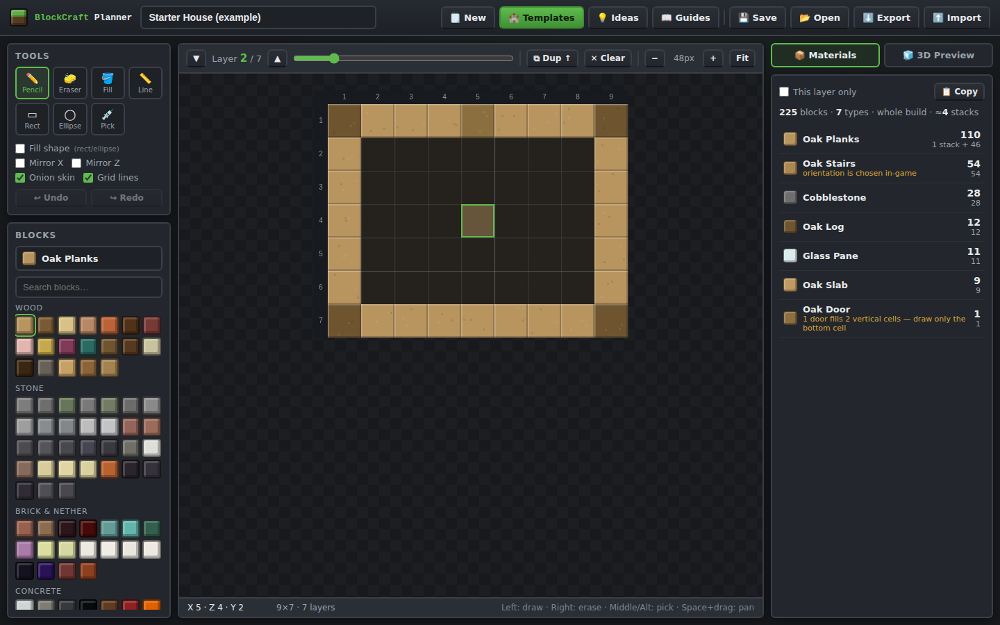
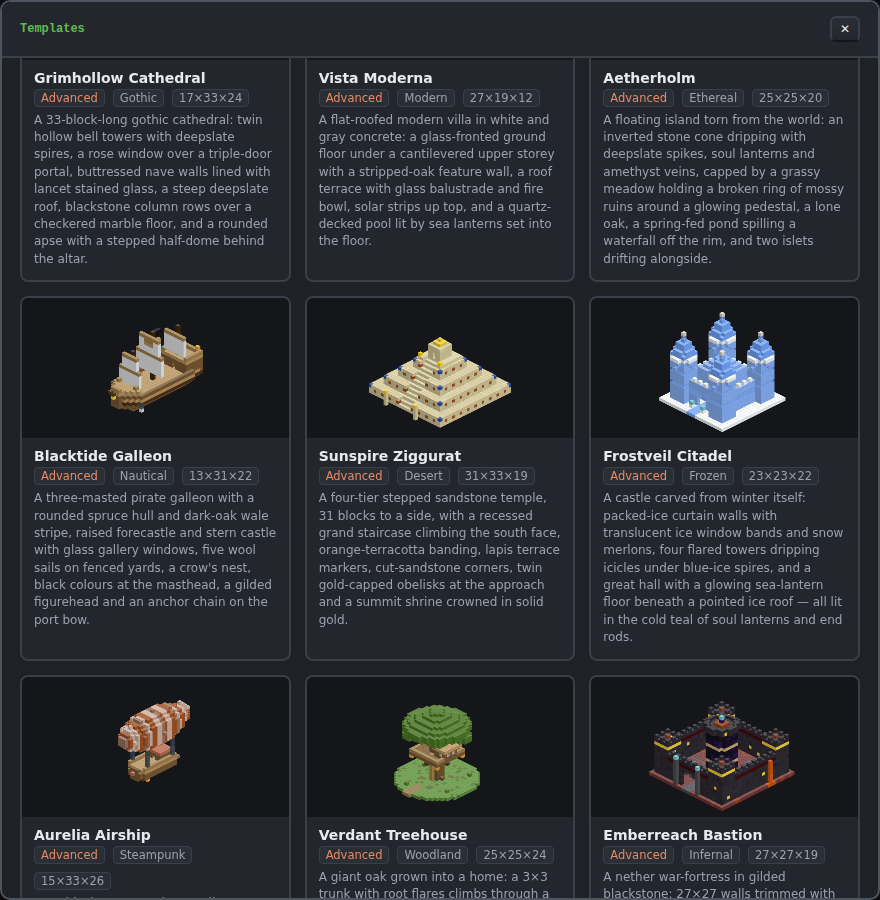

# 🧱 BlockCraft Planner

A free, browser-based **Minecraft building planner**. Draw blueprints layer by layer, get an exact
material shopping list (in stacks and shulker boxes), preview your build in 3D, start from ready-made
templates, and learn from built-in building guides. No installs, no accounts — it's a static site
that runs entirely in your browser.



## ✨ Features

- **Layer-by-layer blueprint editor** — each layer is one Y-level in game, drawn top-down on a grid
  with rulers, onion-skinning of the layer below, and mirror-drawing for symmetric builds.
- **Drawing tools** — pencil, eraser, flood fill, line, rectangle and ellipse (outline or filled —
  ellipse is the secret weapon for round towers), block picker, undo/redo, keyboard shortcuts.
- **200+ block palette** — organized by category with search, using map-accurate colors.
- **Live materials list** — every block counted as you draw, shown as totals, stacks (64) and
  shulker boxes (27 stacks), with one-click copy as a shopping list.
- **3D isometric preview** — rotate the build 90° at a time, with an optional cutaway at the
  current layer.
- **21 built-in templates** in two tiers, each with a 3D thumbnail, full materials list and build tips:
  - *Quick Builds* — starter house, cozy cottage, castle tower, wheat farm, fountain,
    lighthouse, stone bridge and nether portal.
  - *Grand Builds* — thirteen large, intricate showpieces, each with its own vibe:
    **Stonehold Keep** (31×31 medieval castle with curtain walls, gatehouse and central keep),
    **Arcanum Spire** (wizard tower with overhanging study and purpur cone roof),
    **Crimson Pagoda** (four flared roof tiers to a gilded spire),
    **Grimhollow Cathedral** (gothic nave, rose window, buttresses, stained glass and apse),
    **Vista Moderna** (cantilevered modern villa with pool and roof terrace),
    **Aetherholm** (floating sky island with ruins and a rim waterfall),
    **Blacktide Galleon** (three-masted pirate ship under sail),
    **Sunspire Ziggurat** (stepped desert temple with a recessed grand staircase),
    **Frostveil Citadel** (ice castle with glowing sea-lantern floors),
    **Aurelia Airship** (steampunk zeppelin with a copper-ribbed envelope),
    **Verdant Treehouse** (giant oak with a cabin in its platform ring),
    **Emberreach Bastion** (gilded-blackstone nether fortress with lava falls), and
    **Stargazer Dome** (copper-domed observatory with a telescope in its slit).


- **7 building guides** — from using the planner to palettes, roofs, interiors and material math.
- **Save / share** — autosaves in the browser, named saves, JSON export/import, and a printable
  **blueprint sheet PNG** with every layer plus the material list.

## 🚀 Hosting on GitHub Pages

The site deploys automatically via the included GitHub Actions workflow
([`.github/workflows/deploy.yml`](.github/workflows/deploy.yml)) on every push to `main`.

One-time setup:

1. In this repository, go to **Settings → Pages**.
2. Under **Build and deployment → Source**, choose **GitHub Actions**.
3. Push to `main` (or run the *Deploy to GitHub Pages* workflow manually from the Actions tab).
4. Your planner will be live at `https://<username>.github.io/<repo>/`.

> Alternative: because the app is plain static files at the repository root, the classic
> **Deploy from a branch** source (branch `main`, folder `/`) works too.

## 🖥️ Running locally

No build step. Either open `index.html` directly, or serve the folder:

```bash
python3 -m http.server 8080
# then visit http://localhost:8080
```

## 🗂️ Project structure

```
index.html                    app shell
css/style.css                 all styles (dark, blocky theme)
js/blocks.js                  block palette data (ids, names, colors, categories)
js/templates.js               Quick Build templates (hand-written layer strings + legend)
js/templates_large.js         Grand Build templates (generated — do not edit by hand)
js/guides.js                  building guide articles
js/app.js                     editor, materials math, iso preview, save/export
tools/validate.mjs            data integrity check (run: node tools/validate.mjs)
tools/generate_templates.mjs  voxel-primitive generator for the Grand Builds
```

### Blueprint JSON format

Exported files are palette-indexed JSON:

```jsonc
{
  "app": "blockcraft-planner",
  "version": 1,
  "name": "My Build",
  "width": 9, "depth": 7, "height": 7,
  "palette": ["cobblestone", "oak_planks"],   // 1-based indices below
  "layers": [ [ [1,1,1], [1,2,1] /* … depth rows of width cells; 0 = air */ ] ]
}
```

## 🧩 Adding your own template

Small templates in `js/templates.js` are ASCII layers (bottom → top) with a per-template legend —
`.` is air, every row must be `width` chars. Add one and run `node tools/validate.mjs` to check it.

Large builds live in `tools/generate_templates.mjs`, where they're composed from voxel
primitives (boxes, cylinders, ring/annulus, cones, seeded noise). Edit the generator, then:

```bash
node tools/generate_templates.mjs   # rewrites js/templates_large.js
node tools/validate.mjs             # sanity-check everything
```

## License

MIT — build cool things.
